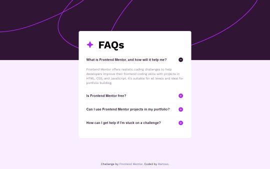

# SPA Developer Portfolio

Hello, my name is Bartosz, and this is a website showcasing my projects. Feel free to explore them and contact me via the form. The website was created based on the design made in Figma from the [Frontend Mentor](https://www.frontendmentor.io/challenges/singlepage-developer-portfolio-bBVj2ZPi-x).
## Table of contents

- [SPA Developer Portfolio](#spa-developer-portfolio)
  - [Table of contents](#table-of-contents)
  - [Overview](#overview)
    - [Getting Started](#getting-started)
    - [Screenshot](#screenshot)
      - [Mobile](#mobile)
      - [Desktop](#desktop)
    - [Links](#links)
    - [Built with](#built-with)
  - [Author](#author)

## Overview

This is a [Next.js](https://nextjs.org/) project bootstrapped with [`create-next-app`](https://github.com/vercel/next.js/tree/canary/packages/create-next-app).

### Getting Started

First, run the development server:

```bash
npm run dev
# or
yarn dev
# or
pnpm dev
# or
bun dev
```

Open [http://localhost:3000](http://localhost:3000) with your browser to see the result.

You can start editing the page by modifying `app/page.tsx`. The page auto-updates as you edit the file.

This project uses [`next/font`](https://nextjs.org/docs/basic-features/font-optimization) to automatically optimize and load Inter, a custom Google Font.

### Screenshot
 
#### Mobile

<!--  -->

#### Desktop

<!--  -->

### Links

- [Source URL:](https://github.com/BartqD/SPA-Portfolio)
- [Live Site URL:](https://spa-portfolio-pi.vercel.app/)

### Built with

- Semantic HTML5 markup
- SCSS 
- Flexbox
- [TypeScript](https://www.typescriptlang.org/) - JS with syntax for types
- [React](https://reactjs.org/) - JS library
- [Next.js](https://nextjs.org/) - React framework
- [MongoDB](https://www.mongodb.com) - Database
- [Framer Motion](https://www.framer.com/motion/) - Animation library

## Author

- GitHub  - [Bartosz](https://github.com/BartqD)


